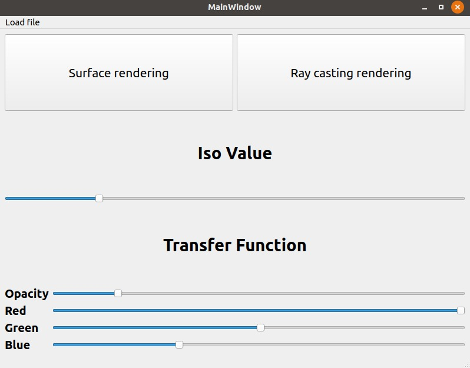
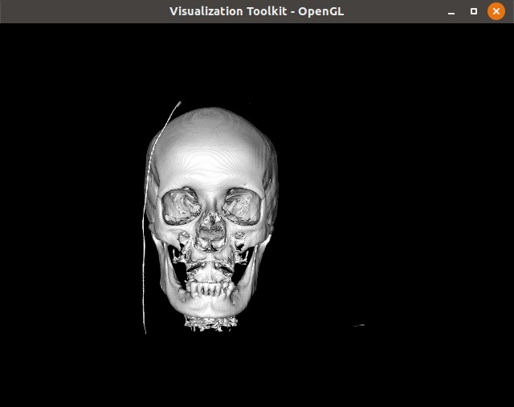
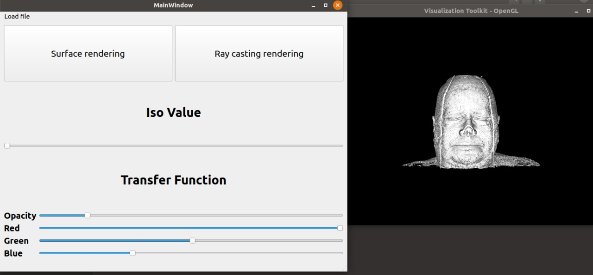
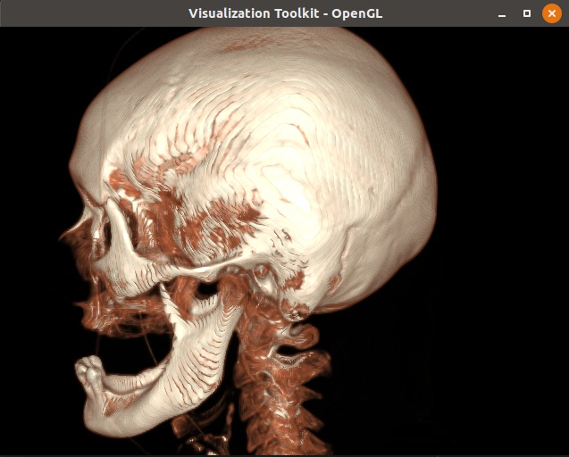
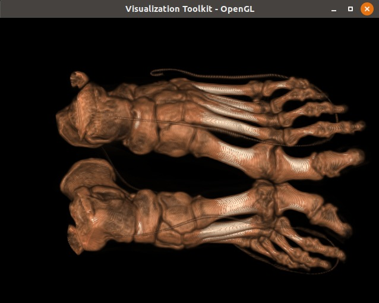
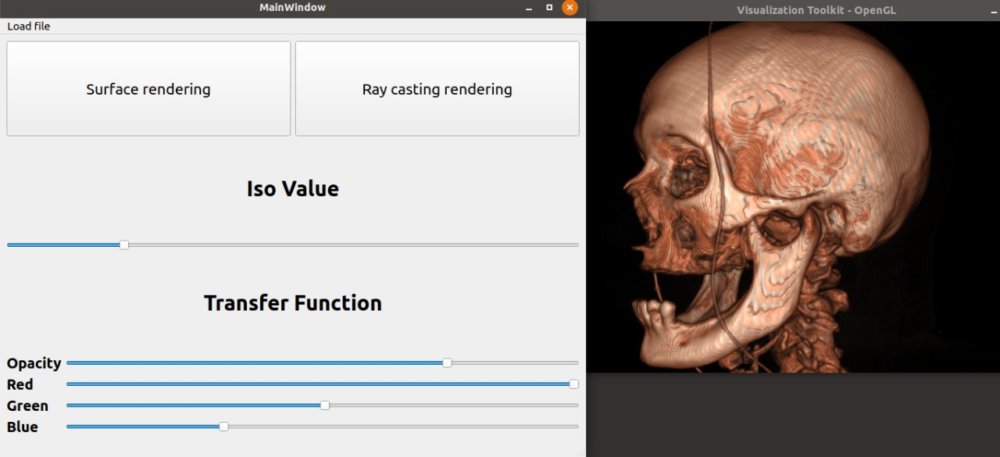
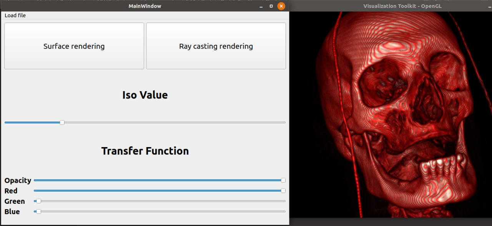
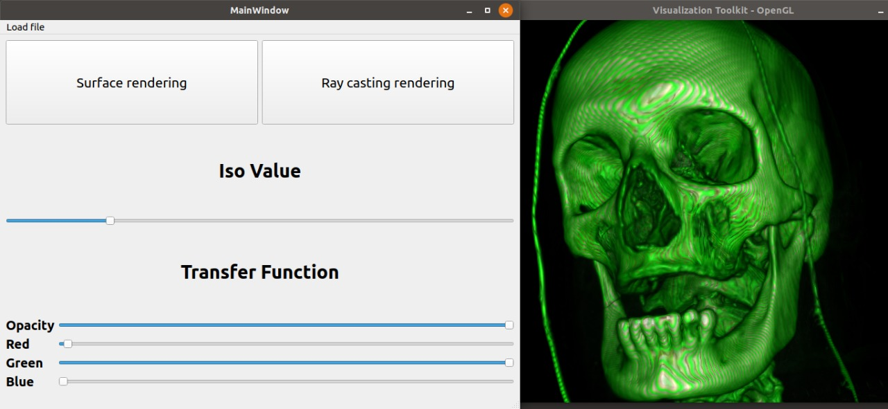
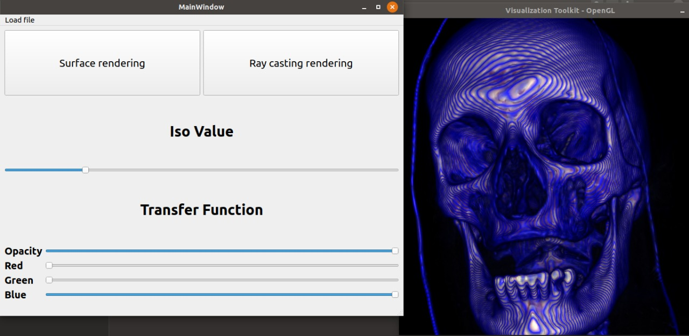

# Volume rendering app with Visualization Toolkit (VTK) & Qt

Objective is to create a 3D object from series of 2D images

## GUI was built using pyqt5 

You can load DICOM images series dynamically by clicking on load file or by clicking one of the two buttons "_Surface renderning, Ray casting rendering_":



- File Upload Function `loadDir`

## Surface rendering

- it's done using the function `surface_rendering`

Here, the isovalue = 500



- Sliders are used to adjust ISO value of surface Rendering Using the function `isovalue_slider`

Here, the isovalue = 0



## Ray casting for direct volume rendering

 - it's done by the function `rayCasting_rendering`

Head ray casting:



Ankle ray casting:



- Adjusting the Opacity and the RGB color of the Casting Ray by Using the Function `transferFunc_slider`

- Controlling the Opacity slider: 
 
  

- Controlling the RGB color sliders:
  
  
  
  
  
  

***

# Run the app

```bash
python app.y
```
