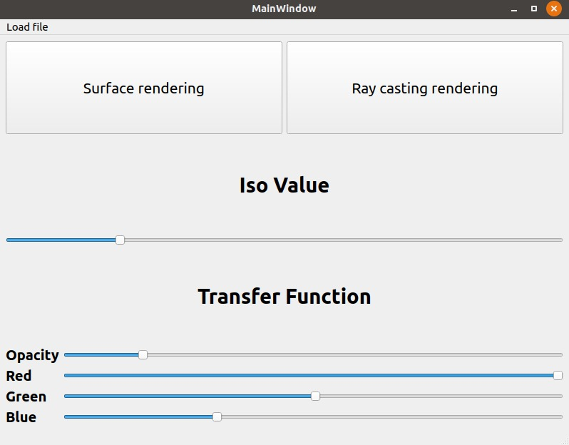
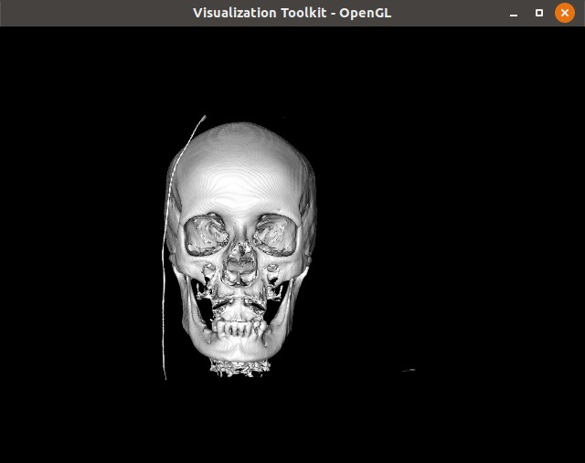
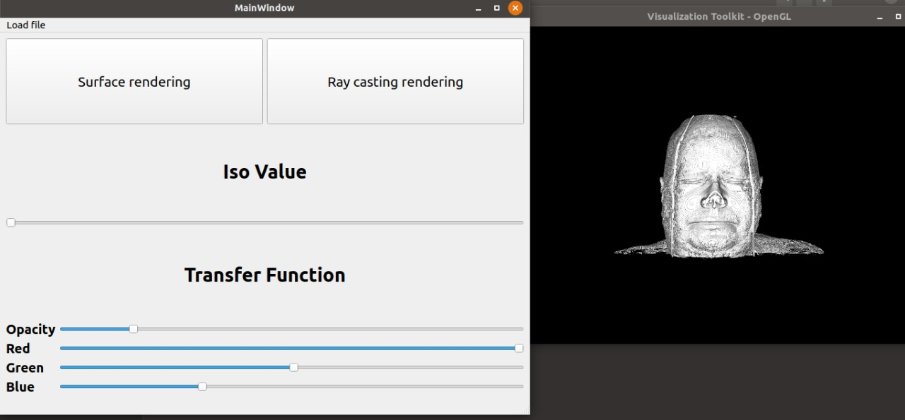
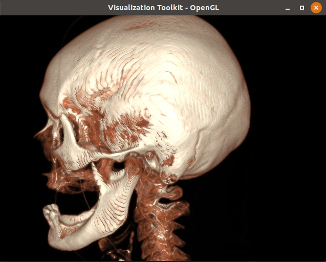
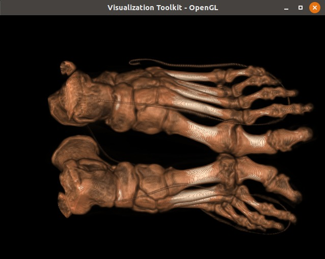
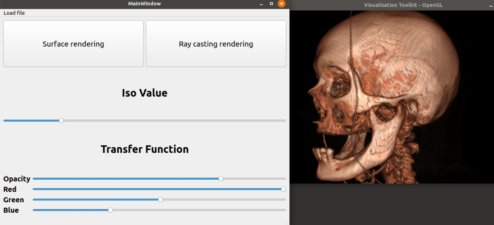
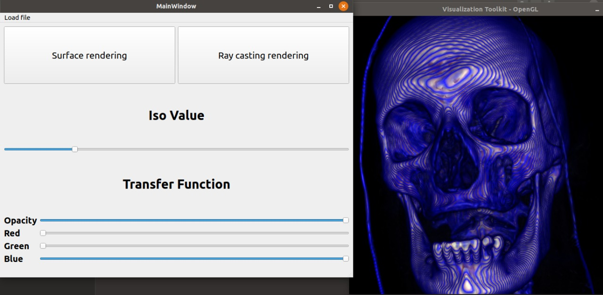
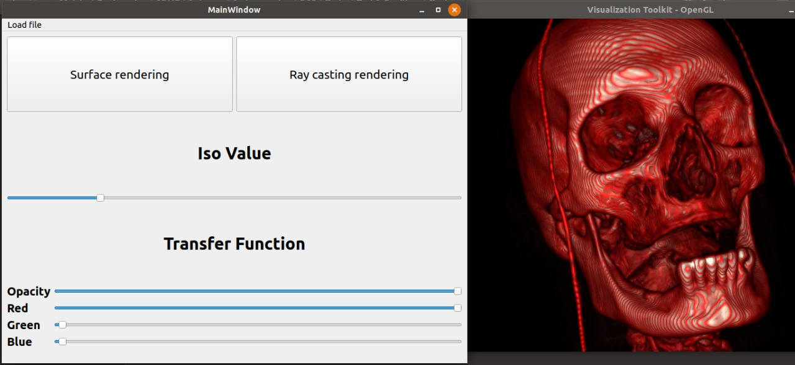
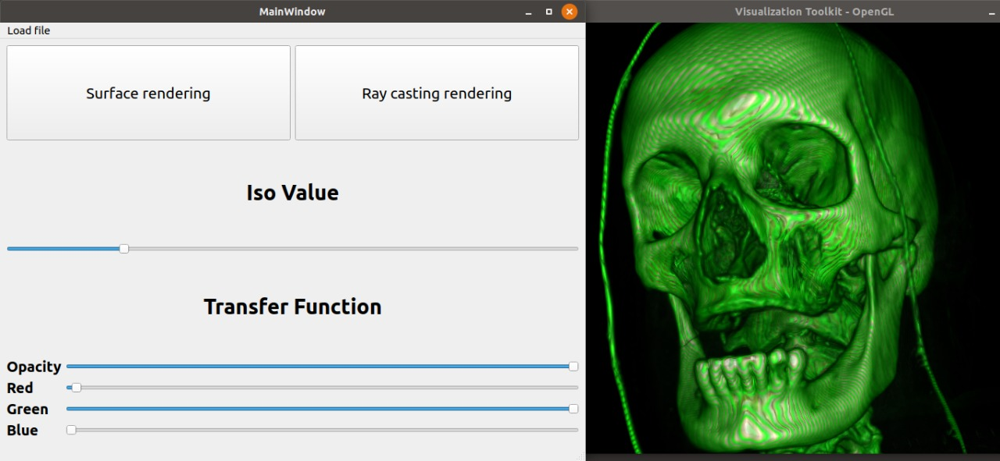

# Volume rendering app with VTK & Qt

## GUI was built using pyqt5 

You can load DICOM images by clicking load file or one of the two buttons "_Surface renderning, Ray casting rendering_":



- File Upload Function `loadDir`

## Surface rendering Function `surface_rendering`

Here the isovalue = 500



- Sliders are used to adjust ISO values of surface Rendering Using the Function `isovalue_slider`



## Ray Casting has been done by the Function `rayCasting_rendering`





- Adjusting the Opacity and the RGB color of the Casting Ray by Using the Function `transferFunc_slider`

- Controlling the Opacity slider: 


- Controlling the RGB color sliders:
  
  
  
  
  
  

***

# Run the app

```bash
python app.y
```